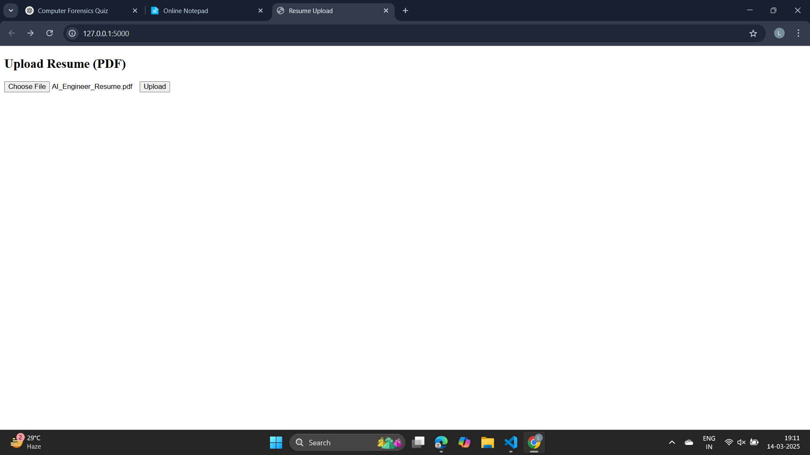
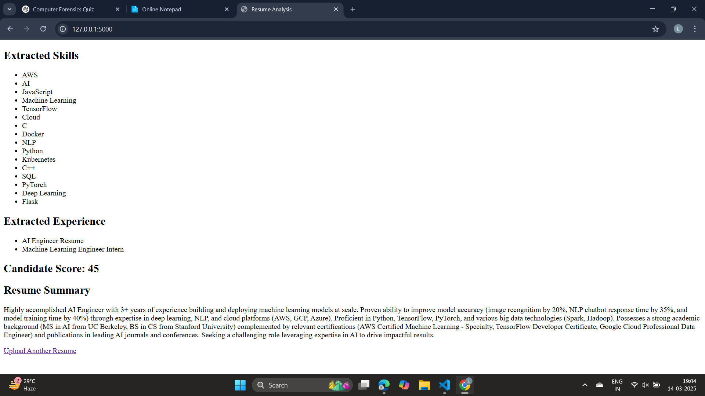

# AI Resume Screener 🔍
A Flask-based AI-powered Resume Screener that extracts skills, experience, and education from resumes using **Python, NLP (SpaCy), and Google Gemini AI**.

## 🚀 Features
✅ Extracts key details like **skills, experience, education** from resumes
✅ Uses **NLP (SpaCy) & Regex** for accurate skill extraction
✅ Generates **AI-powered resume summaries** using **Google Gemini AI**
✅ Scores resumes based on recruiter evaluation criteria

## 📸 Screenshots
### 🔹 Upload Resume Page


### 🔹 Extracted Data


## 🛠️ Installation
1. **Clone the repository**
```bash
git clone https://github.com/KrishnaChaitanya7777/Ai-resume-Screener.git
cd Ai-resume-Screener
2. **Install dependencies**
```bash
pip install -r requirements.txt
3. **Run the Flask app**
```bash
python app.py


